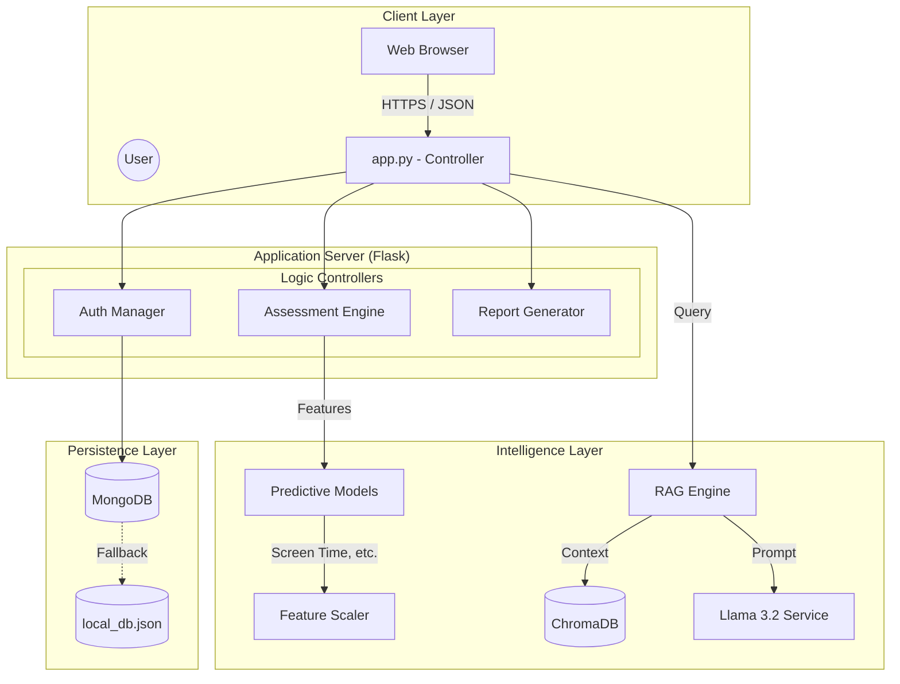
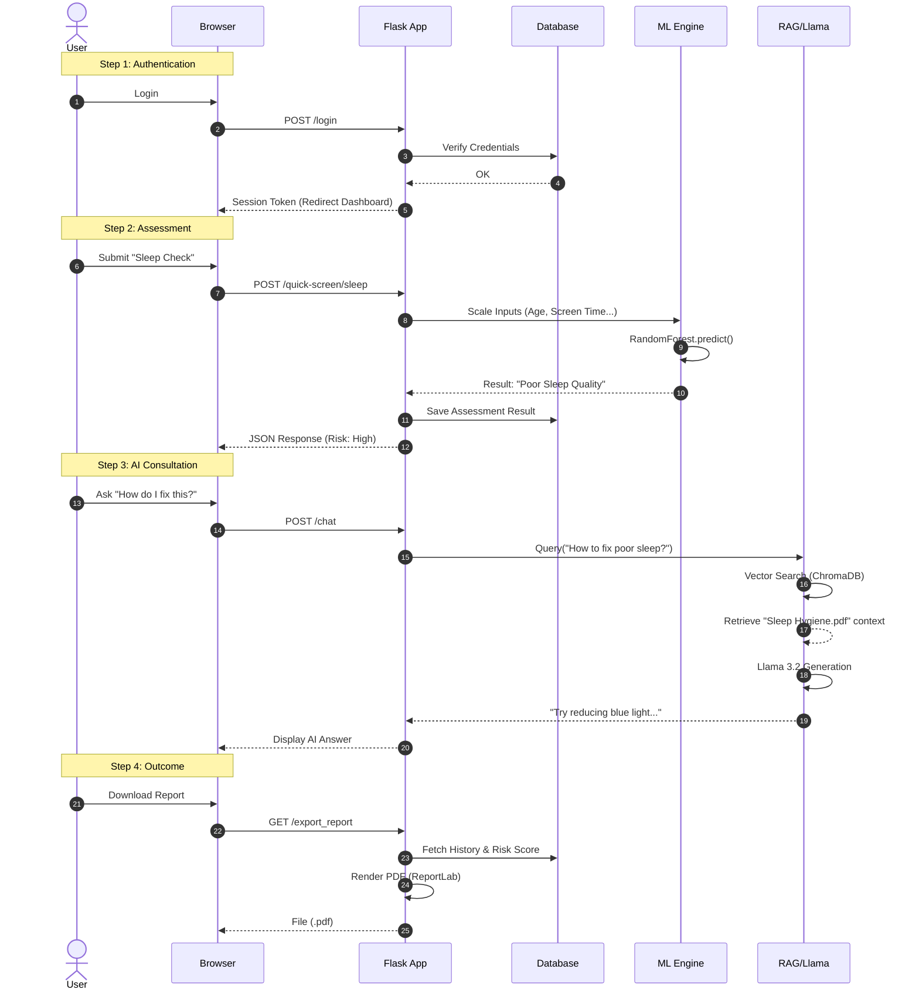

# DC Well Being AI - Technical Deep Dive 📘

## 1. Executive Summary
**DC Well Being AI** is a **Hybrid Intelligence System** designed to bridge the gap between static clinical screening and dynamic emotional support. By combining structured Machine Learning (Random Forest) for risk quantification with Generative AI (Llama 3.2 RAG) for qualitative empathy, the system offers a holistic mental health assessment.

---

## 2. Methodology: The Hybrid AI Approach 🧠

Our methodology fuses two distinct AI paradigms to ensure both **Accuracy** and **Empathy**.

### Phase A: Predictive Modeling (The "Left Brain")
We utilize **Supervised Learning** to detect specific mental health conditions based on quantitative biomarkers and behavioral data.
*   **Algorithm**: `RandomForestClassifier` (Ensemble Learning).
*   **Why Random Forest?**: Selected for its resilience to overfitting on tabular data and ability to handle non-linear relationships (e.g., the complex curve of Sleep Quality vs. Screen Time).
*   **Datasets**:
    *   *Student Sleep Data*: 6-feature input vector (Age, Screen Time, etc.) -> Target: Sleep Quality Index.
    *   *Medical Burnout Data*: 7-feature input vector -> Target: Burnout Risk.
*   **Process**:
    1.  **Ingestion**: Raw CSV data (`dataset/`).
    2.  **Preprocessing**: Standardization (`StandardScaler`) to normalize feature variance.
    3.  **Training**: Model convergence optimized for F1-Score to minimize false negatives (critical in health).
    4.  **Serialization**: Models saved as `.joblib` binaries for <50ms inference time.

### Phase B: Generative Empathy (The "Right Brain")
We implement **Retrieval-Augmented Generation (RAG)** to provide context-aware support.
*   **LLM**: **Llama 3.2** (via Ollama) - chosen for its reasoning capability and speed.
*   **Vector Database**: **ChromaDB**.
*   **Workflow**:
    1.  **Knowledge Base**: Clinical documents (PDFs/JSON) are chunked and embedded.
    2.  **Retrieval**: User queries are converted to vector embeddings. The system retrieves the top-3 most semantically similar clinical snippets.
    3.  **Synthesis**: The LLM generates a response using *only* the retrieved context + User Profile Risk Level, ensuring hallucination-free advice.

---

## 3. System Architecture 🏗️

The application follows a **Modular Monolithic Architecture**, separating concerns while maintaining a unified runtime.

---

## 4. Logical Block Diagram 🧩

A breakdown of the internal functional blocks and their data exchange.

```mermaid
block-beta
    columns 4
    
    block:Frontend
        UI["UI Templates (HTML/Jinja)"]
        AJAX["Async Requests"]
    end

    block:Core
        Route["Routing Logic"]
        Session["Session Mgmt"]
        Security["Pass Hashing"]
    end

    block:ML_Service
        Load["Model Loader"]
        Infer["Inference"]
        Explain["Risk Analysis"]
    end

    block:RAG_Service
        Embed["Embeddings"]
        Search["Vector Search"]
        Gen["Text Gen"]
    end
    
    UI --> Route
    Route --> Session
    Route --> Infer
    Route --> Search
    Search --> Gen
```

---

## 5. Top-to-Bottom Application Flow 🌊

A detailed sequence showing a user's journey from landing on the page to receiving a diagnosis.

---

## 6. Directory Structure Explained
Understanding the "Top to Bottom" code organization.

*   `app.py`: **The Brain**. The central entry point that handles all web requests, routes them to the right logic, and returns page views.
*   `predict_mental_health.py`: **The Predictor**. Contains the logic to load `.joblib` models and run inferences.
*   `rag_engine.py`: **The Librarian**. Manages the Knowledge Base, handles document retrieval, and talks to the LLM.
*   `database.py`: **The Memory**. Handles saving/loading User Profiles and Journals to MongoDB (or local JSON).
*   `llm_interface.py`: **The Voice**. Controls the system prompts and personality of the AI.

---

## 7. Future Roadmap 🚀
*   **Wearable Integration**: Real-time sync with Apple Watch/Fitbit APIs.
*   **Voice Interface**: Speech-to-Text for seamless therapy sessions.
*   **Multi-Modal Analysis**: Analyzing user voice tone for stress markers.
