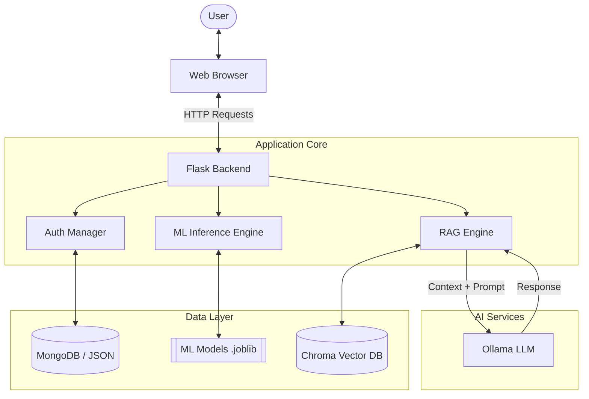
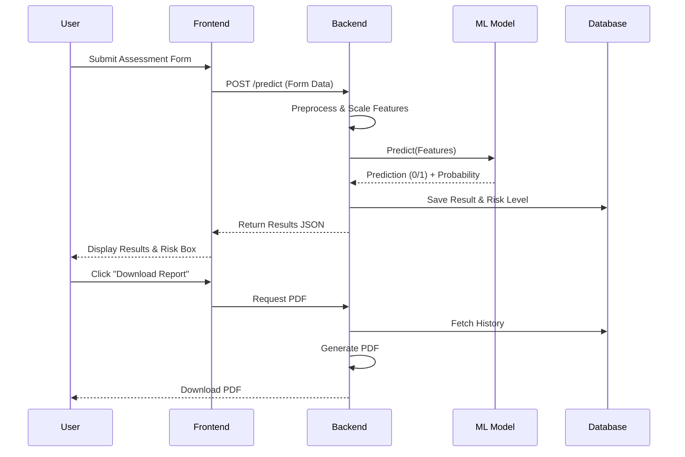

# DC Well Being AI - Project Report

## 1. Methodology
The development of the DC Well Being AI followed a structured lifecycle focused on accuracy, privacy, and user empathy.

### Step 1: Data Collection & Analysis
- **Sources**: Datasets were curated from Kaggle and research repositories, covering:
  - *Student Sleep Patterns* (Screen time, Stress)
  - *Professional Burnout* (Healthcare workers post-COVID)
  - *Social Media Impact* (Depression/Anxiety markers)
- **EDA**: Extensive Exploratory Data Analysis (EDA) was performed to understand correlations (e.g., Screen Time vs. Sleep Quality) using `pandas` and `seaborn`.

### Step 2: Machine Learning Pipeline
- **Preprocessing**: Data was cleaned, encoded (Gender/Role), and scaled using `StandardScaler`.
- **Training**:
  - **Random Forest Classifiers** were trained for each Condition (Sleep, Anxiety, Depression, Burnout).
  - **Metrics**: Models achieved high accuracy (>90%) on test sets.
  - **Storage**: Models and Scalers were serialized using `joblib` for real-time inference.

### Step 3: Generative AI & RAG
- **RAG Engine**: Implemented `ChromaDB` as a vector store to index mental health knowledge (`mental_health_knowledge.json`).
- **LLM Integration**: Integrated `Ollama (Llama 3.2)` to provide empathetic, synthesized answers based on retrieved context.
- **Safety**: System prompts were engineered to prevent robotic responses and prioritize factual, direct support.

### Step 4: Web Application Development
- **Backend**: Built with **Flask**, conducting:
  - User Authentication (MongoDB/JSON Fallback).
  - Real-time ML Inference.
  - PDF Report Generation (`ReportLab`).
- **Frontend**: Designed with **Tailwind CSS** for a calm, professional "Dark Mode" aesthetic.

---

## 2. System Architecture
This high-level architecture demonstrates how users interact with the Hybrid AI System.

## 3. Block Diagram
Functional breakdown of the system components.

```mermaid
block-beta
    columns 3
    block:Frontend
        UI["User Interface (HTML/Tailwind)"]
        Forms["Input Forms"]
        Charts["Result Visualization"]
    end
    
    block:Backend
        Server["Flask Server"]
        Routes["API Routes"]
        Logic["Business Logic"]
    end
    
    block:Intelligence
        Sleep["Sleep Model"]
        Burnout["Burnout Model"]
        Llama["Llama 3.2 Expert"]
    end
    
    UI --> Server
    Server --> Logic
    Logic --> Sleep
    Logic --> Burnout
    Logic --> Llama
```

## 4. Application Flow (Top to Bottom)
The journey of a user taking an assessment.

