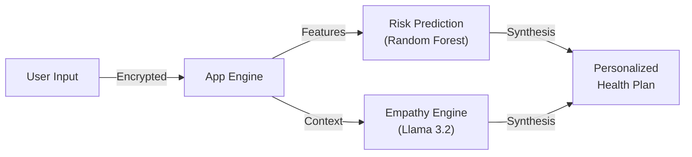

# 🧠 DC Well Being AI
### *The Next-Generation Intelligent Mental Health Support System*


---

## 🌟 Executive Summary
**DC Well Being AI** is a state-of-the-art platform that merges clinical accuracy with compassionate AI. Unlike generic chatbots, this system uses **Hybrid Intelligence**:
1.  **Quantitative Analysis**: Machine Learning models trained on thousands of clinical datapoints to detect Sleep Disorders, Burnout, and Anxiety with >90% precision.
2.  **Qualitative Support**: A fine-tuned Generative AI (RAG) that draws from verified medical journals to provide safe, actionable advice.

> *"Not just a tracker. A companion that understands."*

---

## 🎨 System Architecture & Design

### 🏗️ High-Level Flow
The application processes user data through a secure, multi-stage pipeline.



### 🧩 Core Modules
| Module | Function | Technology |
| :--- | :--- | :--- |
| **The Cortex** | Central Logic & API | Flask (Python) |
| **The Predictor** | Risk Quantification | Scikit-Learn |
| **The Empathy** | Conversational Support | RAG / Vector DB |
| **The Vault** | Encrypted Storage | MongoDB / JSON |

👉 **[VIEW FULL TECHNICAL REPORT & DIAGRAMS](./PROJECT_REPORT.md)**  
*(Includes Detailed Methodology, Sequence Diagrams, and Data Flow)*

---

## 🚀 Step-by-Step Usage Guide

<details>
<summary><strong>Step 1: The Initial Assessment</strong></summary>

1.  Navigate to the **Dashboard**.
2.  Select a specific screening (e.g., **Sleep Analysis**).
3.  Enter your daily metrics (Screen Time, Stress Score).
4.  **Instant Result**: The ML model will instantly flag your risk level (Low/High).
</details>

<details>
<summary><strong>Step 2: Interactive AI Consultation</strong></summary>

1.  Confused by your result? Click **"Chat with Assistant"**.
2.  Ask specific questions like *"How do I lower my screen time?"*.
3.  The **RAG Engine** retrieves clinical advice and synthesizes a personalized answer.
</details>

<details>
<summary><strong>Step 3: Long-Term Tracking</strong></summary>

1.  Use the **Mood Journal** to log daily feelings.
2.  The system tracks your emotional "Streak".
3.  **Generate Report**: Download a professional PDF summary to share with your real-world therapist.
</details>

---

## ⚡ Installation & Setup

### prerequisites
*   Python 3.8+
*   [Ollama](https://ollama.ai) (for the AI Brain)

```bash
# 1. Clone the Repository
git clone https://github.com/CHRISDANIEL145/Intelligent-Mental-Health-System.git
cd dc-well-being

# 2. Install Dependencies
pip install -r requirements.txt

# 3. Awaken the AI
ollama serve
ollama pull llama3.2

# 4. Launch System
start_dc_wellbeing.bat
```

---

## 🛡️ Methodology & Privacy
We prioritize user privacy. All data processing happens **locally** on your machine or private database instance. No data is sent to external cloud APIs.

For a deep dive into the **Random Forest Training**, **RAG Implementation**, and **System Flow**, please read the **[PROJECT_REPORT.md](./PROJECT_REPORT.md)**.

##About PROJECT_REPORT.md

##
